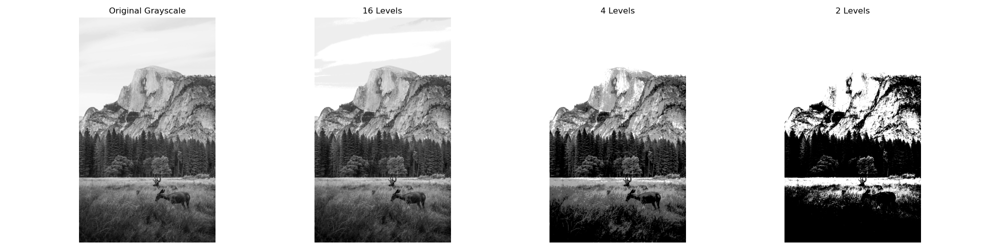
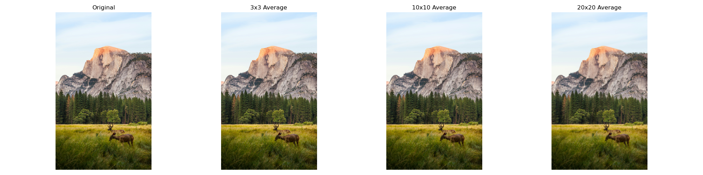
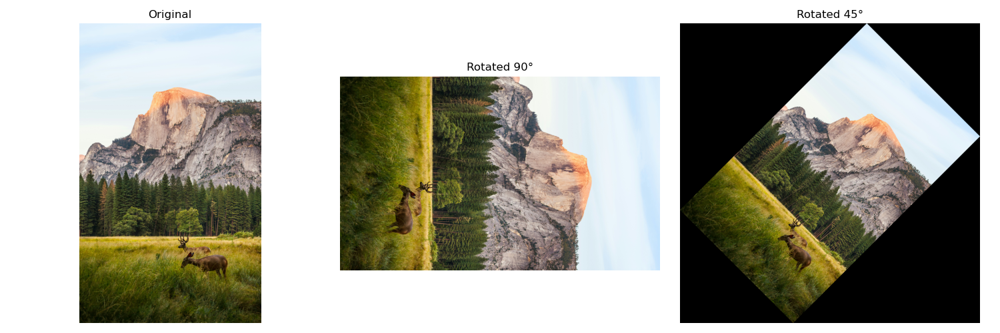
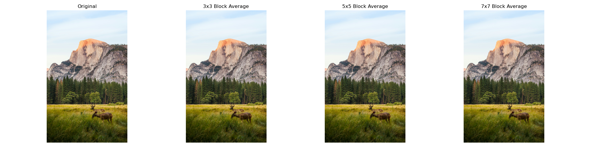

# Computer Vision: Fundamental Image Processing Operations

This repository contains a Python project for the EC7212 - Computer Vision and Image Processing course. It implements four fundamental image processing operations using a modular structure and leverages the power of **OpenCV** and **NumPy** for efficient computation.

The key tasks demonstrated are:

1.  **Intensity Level Reduction:** Quantizing image intensity values.
2.  **Spatial Averaging:** Applying blurring filters of various sizes.
3.  **Image Rotation:** Performing geometric rotation, including an advanced non-cropping method.
4.  **Spatial Resolution Reduction:** Simulating pixelation by block averaging.

---

## Project Structure

The code is organized into a `tasks` package, promoting code reusability and maintainability. A main script orchestrates the execution of all tasks.

```
image-processing-assignment/
├── tasks/
│   ├── __init__.py               # Makes 'tasks' a Python package
│   ├── utils.py                  # Helper functions (image loading, display)
│   ├── task1_intensity.py        # Logic for intensity level reduction
│   ├── task2_averaging.py        # Logic for spatial averaging (uses OpenCV)
│   ├── task3_rotation.py         # Logic for image rotation (uses OpenCV)
│   └── task4_resolution.py       # Logic for spatial resolution reduction
├── main.py                     # The main script to run all tasks
├── sample_image.png            # A sample source image
├── requirements.txt            # Project dependencies
└── results_opencv/             # Directory where output images are saved
```

---

## Getting Started

Follow these steps to set up and run the project on your local machine.

### 1. Prerequisites

- Python 3.7+
- Git

### 2. Setup

1.  **Clone the repository:**

    ```bash
    git clone https://github.com/Pabasara715/image-processing-assignment.git
    cd image-processing-assignment
    ```

2.  **Create and activate a virtual environment:**
    This isolates the project's dependencies from your system's Python installation.

    ```bash
    # For Windows
    python -m venv venv
    .\venv\Scripts\activate

    # For macOS/Linux
    python3 -m venv venv
    source venv/bin/activate
    ```

3.  **Install dependencies:**
    This command reads the `requirements.txt` file and installs the necessary libraries (OpenCV, NumPy, Matplotlib).
    ```bash
    pip install -r requirements.txt
    ```

### 3. Execution

Run the main script from the root directory. It will process the `sample_image.png` and save all visual results in the `results_opencv/` folder. The script will execute very quickly thanks to OpenCV's optimizations.

```bash
python main.py
```

---

## Results and Explanations

The following are the results of each operation performed on the sample image.

### Task 1: Intensity Level Reduction

**Explanation:** This operation, also known as quantization, reduces the number of distinct intensity levels in an image. An 8-bit grayscale image has 256 levels (0-255). This algorithm maps ranges of the original intensities to a smaller set of new values spread across the full dynamic range. This can lead to an artifact called **false contouring**, which becomes more visible as the number of levels decreases. The core logic is implemented with pure NumPy.

**Result:**

_As the number of levels decreases from 256 to 2, the smooth gradients in the image are replaced by abrupt changes, clearly showing the posterization effect._

### Task 2: Spatial Averaging

**Explanation:** Spatial averaging is a low-pass filtering technique used for image blurring and noise reduction. This is implemented using the highly optimized `cv2.blur()` function. It works by replacing each pixel's value with the average value of its neighbors within a defined `N x N` kernel. A larger kernel averages over a wider area, resulting in a more pronounced blur.

**Result:**

_The blurring effect is subtle with a 3x3 kernel but becomes very strong with 10x10 and 20x20 kernels, obscuring fine details and demonstrating powerful smoothing._

### Task 3: Image Rotation

**Explanation:** This geometric transformation rotates the image. The implementation uses a "best-of-both-worlds" approach:

- For **90-degree rotations**, it uses the fast and lossless `cv2.rotate` function.
- For other angles like **45 degrees**, it uses an advanced method with `cv2.warpAffine`. This method calculates a new, larger bounding box for the output image and adjusts the transformation matrix to ensure that the entire source image is visible without being cropped.

**Result:**

_The 90-degree rotation is sharp and clean. The 45-degree rotation is performed without cropping the corners, placing the full rotated image in the center of a newly sized canvas._

### Task 4: Spatial Resolution Reduction

**Explanation:** This operation simulates a reduction in spatial resolution by creating a "pixelated" effect. The algorithm divides the image into non-overlapping `N x N` blocks and replaces all pixels within each block with the block's average intensity. This is implemented using pure NumPy by iterating through the image in steps equal to the block size.

**Result:**

_The blocky effect is clearly visible and becomes more pronounced as the block size increases from 3x3 to 7x7. This technique effectively downsamples the image's spatial information._
